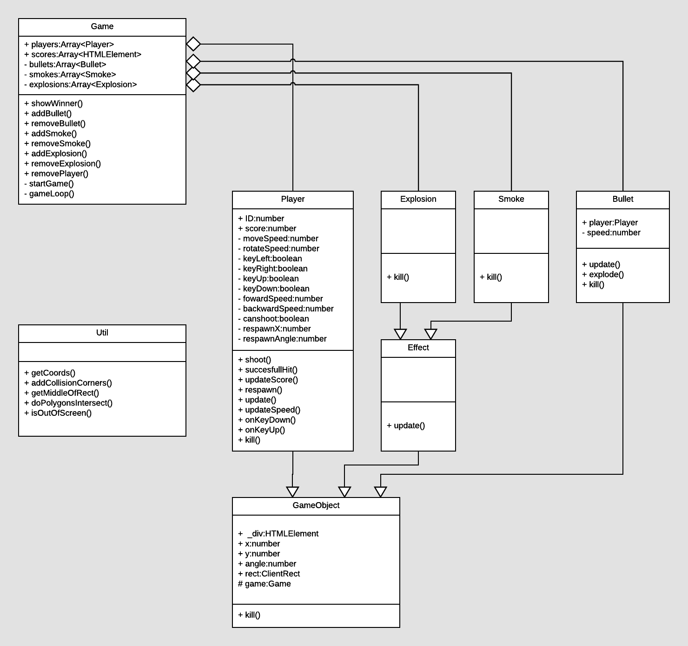

# PRG04-EindOpdracht: My First Typescript Game
This is my first typescript/web game I've ever made. It's a player VS player tank game in which 2 people on the same computer/keyboard compete against eachother. The goal of the game is to simply blow eachother up by shooting and dodging bullets. Most of my time and effort has been put into quality aspects of the game like: rotated rectangle collision detection, smooth controls/movement of player objects and using actual game art assets.

The game does not have a name yet, any suggestions are always welcome.

## Requirements
- 2 Players on 1 computer/keyboard
- Chrome Browser (Haven't tested on other browsers, but they might also work)

## Controls
Player 1:
- **Forward/Backward:** W/S
- **Rotating:** A/D
- **Shoot:** Spacebar

Player 2:
- **Forward/Backward:** ↑/↓
- **Rotating:** ←/→
- **Shoot:** P

## Installation / How To Play
It's a web/typescript game, so all you need is a (chrome) browser.
You can **play the game** at [the github docs of this project](https://brandonyuen.github.io/PRG04-EindOpdracht/).

**The first player to score 5 points wins.**

## UML
The image below represents a Class Diagram (UML) of the game's code.

## OOP Principes (Dutch)
In de UML afbeelding hierboven en de code zelf is te zien hoe ik OOP Principes heb gebruikt zoals "Classes en Instances", "Encapsulation", "Composition" en "Inheritance". Ik zal elk van deze principes toelichten met voorbeelden uit mijn code.

- **Classes en Instances:** In het klassediagram zien we verschillende classes zoals "Game", "GameObject", "Player", etc. Van elke class kunnen we in principe meerdere instances maken. Al maak ik in dit geval maar 1 game instance aan, omdat we 1 game tegelijk spelen. Echter maken we bijvoorbeeld elke keer dat er een kogel word afgeschoten een nieuwe instance aan van "Bullet".

- **Inheritance:** In het klassediagram is te zien dat sommige classes elkaar overerven. Dit is gedaan om het dupliceren van code tegen te gaan. Een bullet en een player hebben bijvoorbeeld een aantal dingen gemeen met elkaar: hun x en y waardes voor een positie, een HTMLElement (div) en ze moeten allebei verwijderd kunnen worden uit de DOM met een kill() functie. Al deze dingen die ze gemeen hebben staan daarom in de class "GameObject", en alle dingen die uniek zijn staan in hun eigen class.

- **Encapsulation"** Encapsulation houd in dat je dingen gescheiden van elkaar houd waar dit logisch/nodig is. Door verschillende classes te gebruiken en hun functionaliteiten met regels op te stellen (public, private, protected) kan ik voorkomen dat er "perongeluk" code word uitgevoerd waar dit eigenlijk niet mag gebeuren. Een voorbeeld hiervan is het gebruik van private, protected en public variabelen in vrijwel elke class. Een ander voorbeeld is in de **player** class te zien waarin ik een **onKeyDown()** en **onKeyUp()** functie heb zitten die **private** is. Deze functie mag namelijk alleen te bereiken zijn door de player class zelf, omdat het de rest van de code niks aan gaat.

- **Composition:** Door gebruik van composition kan een class andere instances bij zich houden om later te benaderen. Dit is goed te zien in het klassediagram. Een voorbeeld hiervan is dat een "Game" class meerdere "Player" instances kan hebben. Deze worden opgeslagen in de "Players:Array<Player>" variable. Dit is hetzelfde voor de bullets, explosions en smokes.
